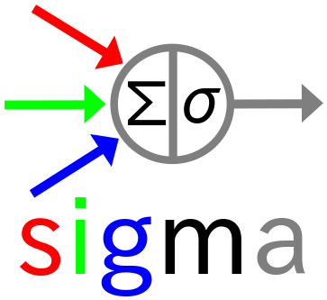

# Software Integration Group Machine Armory


sigma is short for `S`oftware `I`ntegration `G`roup `M`achine-Learning `A`rmory. Unlike `Keras` which is class based, `sigma` is a functional fashion framework. That is, all layers are functions rather than classes.

# Support layers
  - actives
    - [x] crelu
    - [x] relu
    - [x] relu6
    - [x] elu
    - [x] selu
    - [x] leaky_relu
    - [x] softmax
    - [x] softplus
    - [x] softsign
    - [x] sigmoid
    - [x] linear
    - [x] squash
  - base
    - [x] flatten
    - [x] reshape
    - [x] maskout
    - [x] expand_dims
    - [x] input_spec
    - [x] label_spec
    - [ ] embedding
  - convolutional
    - [x] fully_connected [aka. dense]
    - [ ] conv1d
    - [x] conv2d
    - [x] conv3d
    - [x] deconv2d
    - [x] soft_conv2d [aka. deformable convolution]
    - [ ] sepconv2d [aka. separable_conv2d]
  - capsules
    - [x] norm
    - [ ] conv1d
    - [x] conv2d
    - [x] fully_connected [aka. dense]
  - losses
    - [x] binary_cross_entropy
    - [x] categorical_cross_entropy
    - [x] mean_square_error
    - [ ] mean_absolute_error
    - [ ] winner_takes_all
    - [x] margin_loss
  - metrics
    - [x] accuracy
    - [ ] auc
    - [ ] false_negatives
    - [ ] false_positives
    - [ ] true_negatives
    - [ ] true_positives
    - [ ] mean_iou
    - [ ] precision
    - [ ] recall
  - regularizers
    - [x] total_variation_regularize
  - merge
    - [x] concat
    - [x] add (with weights)
    - [ ] mul
  - normalization
    - [x] instance_norm
    - [ ] conditional_instance_norm
    - [x] batch_norm
    - [ ] dropout
  - pools
    - [ ] avg_pool2d
    - [ ] avg_pool2d_global
    - [x] max_pool2d
    - [ ] max_pool2d_global

# useful functions
  - [x] session
    - build Session object with all setup done (e.g., checkpoints, logs)
  - [x] build_model
    - build workflow given build_fun to build networks
  - [x] build_reader
  - [x] train
  - [x] run
    - run train progress
  - [ ] predict
  - [x] build_experiment
    - experiment-level function to pack functions to do experiment
  - [ ] type check

# Advantages
  - seamless with original tensorflow library
  - with statement to set default value
    - e.g., with sigma.defaults(layers, parameters=values)
  - deformable convolutional layers. with gather element mode.
    see [Deformable Convolutional Networks](https://arxiv.org/abs/1703.06211) for details.
    - naive : just cast float location to int
    - nearest : get the nearest location
    - floor : get the floor location
    - ceil : get the ceil location
    - bilinear : bilinear interpolation
  - graph visualization
    - print no message [layers.core.__graph__=None]
    - terminal print [layers.core.__graph__=False]
    - save to file [layers.core.__graph__=True]
    - print details [layers.core.__details__=True]
  - load / save and import / export
    - checkpoints
      - [x] load / save
    - weights
      - [x] import_weights / export_weights
    - model
      - [ ] import_model / export_model
  - progress display
      - [x] sigma.helpers.line

# Version explanation
`sigma` version consists of three parts:
  - major version indicator
    - increases after great changes
  - minor version indicator
    - increases after adding new features
  - update indicator
    - increases after each reported bugs fixing
  - state version indicator
    - 0 : releasable (mainly clean code up)
    - odd : developing state
    - even (except for 0) : testing state
  - pid version indicator
    - used for multi-person parallelly developments
      (that is, used for distinguishing developers)

# Developing progress

```
                              devel
                                ^
                                |
     devel     developer-0  /-------\           /-------\
      ^^      /----------->|x.x.y.o.0|<------->|x.x.y.e.0| => test -------|
      ||     /              \-------/           \-------/                 |
   /-------\/  developer-1  /-------\           /-------\                 |
  | x.x.y.o |------------->|x.x.y.o.1|<------->|x.x.y.e.1| => test ------>|
   \-------/\               \-------/           \-------/                 |
       ^     \ developer-2  /-------\           /-------\                 |
       |      \----------->|x.x.y.o.2|<------->|x.x.y.e.2| => test ------>|
       |                    \-------/           \-------/                 |
       |                                                                  v
       |bug reports                                                   /-------\           /-------\
       |                                         integration test <= | x.x.y.e |<------->|x.x.y+1.0| => stable
       |                                                              \-------/           \-------/
       |                                                                                      |
       |                                                                                      v
   /------\                                                                               /-------\
  | master |---------------------------------------------------------------------------->|  master |
   \------/                                merge x.x.y.0                                  \-------/
```
